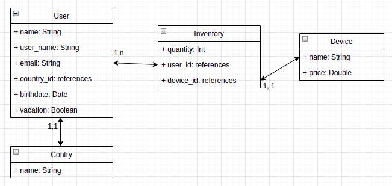

# README
## **Instalação**

> Considerações esse tutorial de instalçao do porjeto leva em conta que o sistema operacional onde esta sendo instalado seja linux de distribuição baseada em Debian.

```
Clonar projeto no link ---    
Com a versão do ruby 3.1.0 instalada em sua maquina dentro do diretorio do projeto excute $ bundle install

Banco de dados
Banco de dados usado é postgres, é necessario ter instalado a lib libpq-dev, comando: $ sudo apt install libpq-dev

Dados de conexão com banco de dados
criar um arquivo.env com o seguinte conteudo:
    DB_USERNAME=postgres
    DB_PASSWORD=postgres
    DB_PORT=5432
    DB_HOST=localhost
Obs: DB_USERNAME e DB_PASSWORD deve conter os dados de conexão do seu postgres.

Para inicializar a aplicação 
O comando a seguir ira preparar a esturura do banco de dados e inicializar ele com os dados necessarios de equipamentos e países assim como dois usuarios para teste.
execute $ rails db:create db:migrate db:seed

Sevidor
Para inicializar a aplicação execute
$ rails s
Assimm a API ficará disponivel em localhost:3000
````


## **DER**
 
 modelagem de dados considerada para o projeto.
 

## **API**

    Countries

    GET /countries

    Retorna a lista de países contendo id e nome.

    retorno:    
    [{
        "id": 1,
        "name": "Afeganistão"
    },
    {
        "id": 2,
        "name": "África do Sul"
    },...]
    
    ----------------------------------------

    Users

    GET /users
    Exibe a lista de usuarios disponiveis para negociação de produtos com seus respectivos inventarios

    retorno: 
    [
        {
            "name": "thiago",
            "user_name": "tcalura",
            "email": "thiagocalura@email.com",
            "birthdate": "1995-06-19",
            "vacation": true,
            "country": "Brasil",
            "inventories": [
                {
                    "quantity": 50,
                    "device": {
                        "id": 1,
                        "name": "Desktop Gamer",
                        "price": "252.0"
                    }
                },...
            ]
        },{
            "name": "thiago",
            "user_name": "tcalura",
            "email": "thiagocalura@email.com",
            "birthdate": "1995-06-19",
            "vacation": true,
            "country": "Brasil",
            "inventories": [
                {
                    "quantity": 50,
                    "device": {
                        "id": 1,
                        "name": "Desktop Gamer",
                        "price": "252.0"
                    }
                },...
            ]
        },...
    ]


    GET /users/:id
    Exibe os dados do usuario solicitado pelo :id

    retorno:
    {
        "name": "Thiago",
        "user_name": "tcalura",
        "email": "thiagocalura@email.com",
        "birthdate": "1995-06-19",
        "vacation": false,
        "country": "Brasil",
        "inventories": [
            {
                "quantity": 50,
                "device": {
                    "id": 1,
                    "name": "Desktop Gamer",
                    "price": "252.0"
                }
            },...
        ]
    }


    PATCH /users/:id
    Alterea os dados solicitados entre vacation e country do usuario solicitado pelo :id
    Obs: não é obrigatorio passar ambos paramentos juntos, pode ser feito com apenas um por vez.

    envio: 
    {
        "vacation": true,
        "country_id": 31
    }

    retorno: 
    {
        "name": "first",
        "user_name": "tcalura",
        "email": "thiagocalura@email.com",
        "birthdate": "1995-06-19",
        "vacation": false,
        "country": "Brasil",
        "inventories": [
            {
                "quantity": 50,
                "device": {
                    "id": 1,
                    "name": "Desktop Gamer",
                    "price": "252.0"
                }
            },...
        ]
    }


    POST /users
    Criaçao de um novo usuario.

    envio:
    {
        "name": "Thiago",
        "user_name": "tcalura",
        "email": "thiago@teste.com",
        "birthdate": "19/06/1995",
        "vacation": false,
        "country_id": 31,
        "devices": [{"id": 4, "quantity": 2}]
    }

    retorno:
    {
        "name": "Thiago",
        "user_name": "tcalura",
        "email": "thiago@teste.com",
        "birthdate": "1995-06-19",
        "vacation": false,
        "country": "Brasil",
        "inventories": [
            {
                "quantity": 2,
                "device": {
                    "id": 4,
                    "name": "Smartphone",
                    "price": "50.0"
                }
            }
        ]
    }
    
    ----------------------------------------

    Negotiations

    POST /negotiations
    Cria uma nova negociação 
    Obs: dentro do hash user deve conter os dados do usuario solicitante, como os equipamentos que ele possui e deseja trocar, e dentro do hash target_user devem conter os dados do usuario e equipamentos que ele possui onde o solicitante deseja.  

    envio:
    {
        "data": {
            "user":{
                "user_id": 1,
                "devices": [{"id": 3, "quantity": 1}]
            },
            "target_user": {
                "user_id": 2,
                "devices": [{"id": 4, "quantity": 2}, {"id": 5, "quantity": 1}]
            }
        }
    }

    retorno:
    {
        "data": "negotiation processed"
    }

    
